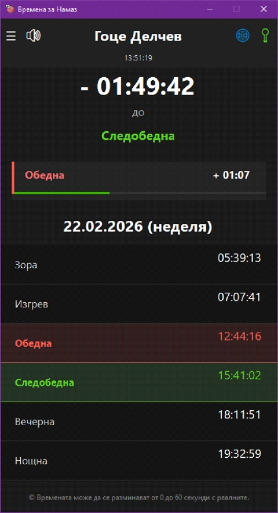
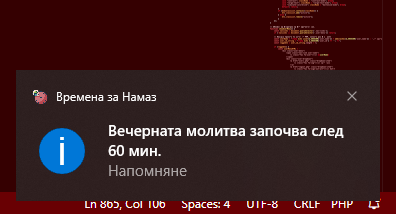
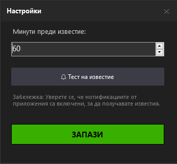

# 💻 Десктоп Приложение (Windows)

Леко и ненатрапчиво Windows приложение, създадено да работи тихо във фонов режим. Идеално за хора, които прекарват дълго време пред компютъра и се нуждаят от дискретни напомняния.

---

## ✨ Ключови функционалности
* **Работа в System Tray:** Приложението се минимизира до часовника и не пречи на работния процес.
* **Auto-Start:** Възможност за автоматично стартиране заедно с Windows.
* **Native Windows известия (Toast Notifications):** Изскачащи прозорци с напомняния преди всяка молитва.
* **Офлайн алгоритъм:** Същото изчислително ядро, използвано в мобилното приложение.

## 📸 Галерия

**Главен интерфейс на приложението**

**Windows Известие (Toast Popup)**

**Настройка на известията**

---

## 🛠 Технически детайли
* **Технология:** C# (WPF / Windows Forms)
* **Архитектура:** Standalone изпълним файл (`.exe`) с минимален отпечатък върху RAM паметта.
