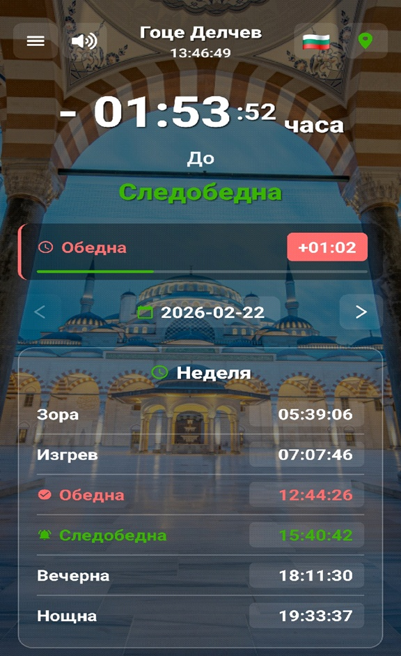
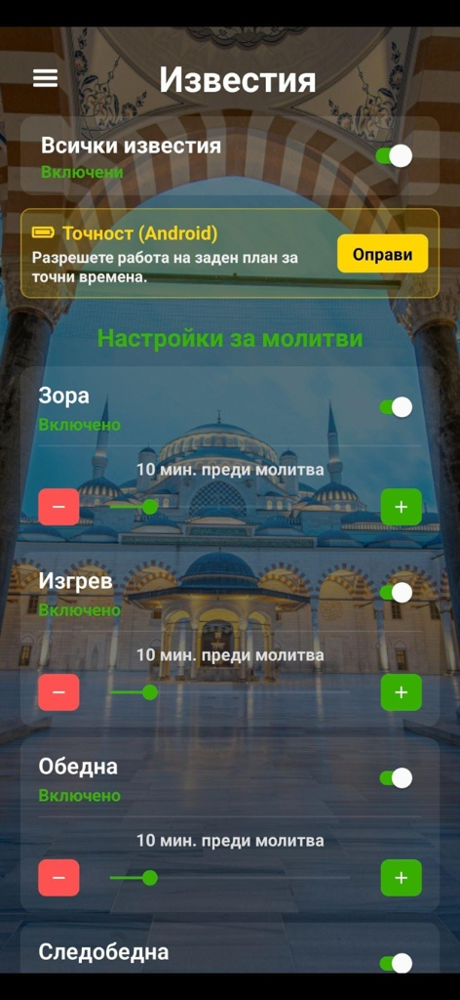
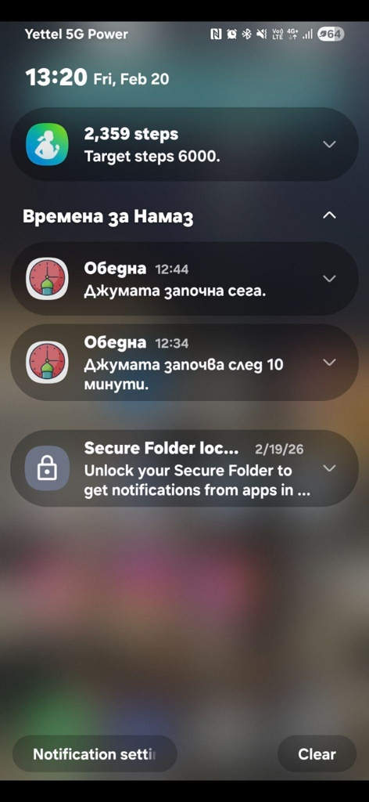

# 📱 Мобилно приложение (Android & iOS)

Мобилното приложение предоставя максимална прецизност и автономия в джоба на потребителя. Основният му приоритет е надеждната работа във фонов режим (background execution), за да гарантира, че известията за молитви никога няма да закъснеят.

---

## ✨ Ключови функционалности
* **100% Офлайн изчисления:** Времената се генерират локално на телефона, без нужда от интернет връзка.
* **Смарт известия (Push Notifications):** Напълно персонализируеми аларми (напр. "10 минути преди изгрев").
* **Гласово четене:** Интегриран Text-to-Speech модул за хора с увредено зрение.
* **Автоматично локализиране:** Обновяване на времената при смяна на населеното място.

## 📸 Галерия

**Главен екран с времена**

**Персонализирани Настройки за известия**

**Системни Push Нотификации**

---

## 🛠 Технически детайли
* **Фреймуърк:** React Native / Expo (или посочи ако е нативно Android/Java)
* **Background Tasks:** Оптимизирано управление на системните ресурси за избягване на "убиване" на процеса от OS (Doze mode на Android).
