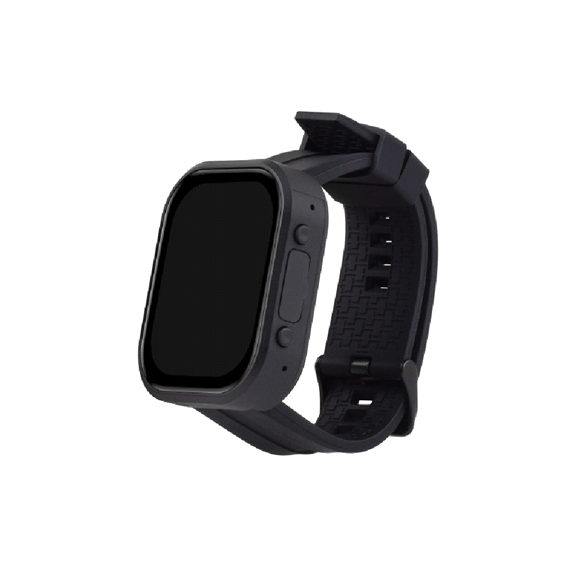
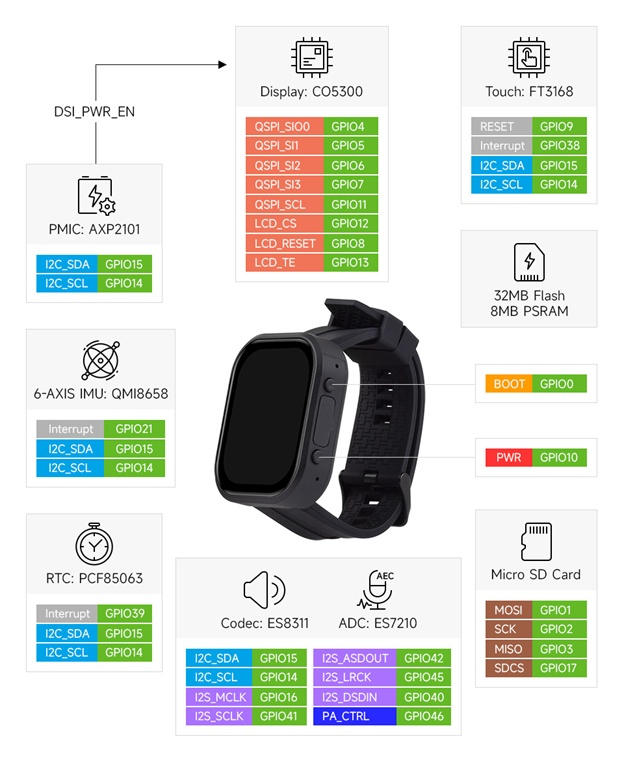

#  Смарт Часовник (Firmware)

Софтуерно осигуряване на ниско ниво (фърмуер) за специализиран водоустойчив смарт часовник, интегриран в екосистемата "Времена за Намаз".

---

##  Ключови функционалности
* **Хардуерно оптимизиран алгоритъм:** Математическият модел е пренаписан на C/C++ за изпълнение върху микроконтролер с ограничени ресурси.
* **Rise To Wake:** Активиране на екрана при повдигане на ръката (базирано на 6-осов IMU сензор QMI8658).
* **Енергийна ефективност:** Агресивно управление на съня на процесора (Deep Sleep) за максимален живот на батерията.
* **Нотификации:** Изпращане на известия при достигане на време за молитва както и преди него.

##  Галерия

**Прототип на часовника**

**Pin Definition на часовника**

---

##  Технически детайли
* **Езици:** C, C++, Kotlin
* **Хардуерни интеграции:** Драйвери за дисплей, QMI8658 6-Axis IMU (Акселерометър и Жироскоп), управление на батерията, GPS модул.
* **Среда за разработка:** ESP-IDF / Arduino IDE / специфично SDK на производителя.
