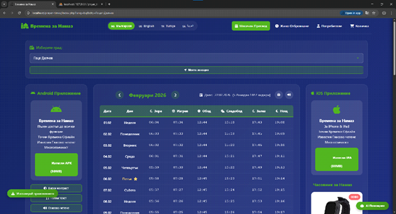
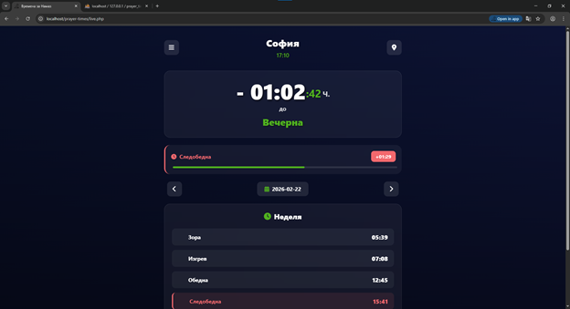
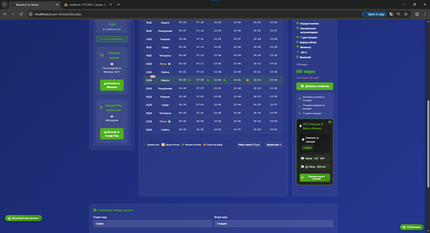
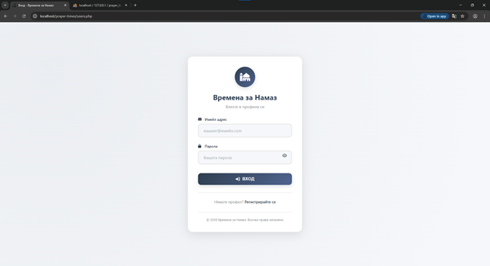
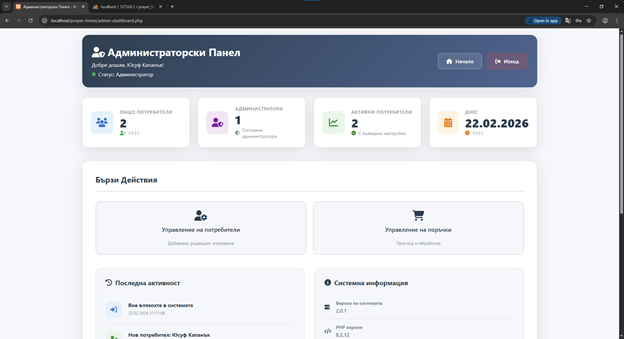

# 🌐 Уеб Платформа и PWA (Времена за Намаз)

Това е основният уеб модул на екосистемата, изграден с фокус върху достъпността и бързодействието. Платформата служи едновременно като информационен портал, PWA (Progressive Web App) за мобилни устройства и административен панел.

---

## ✨ Ключови функционалности
* **Пълнофункционално PWA:** Инсталира се директно на устройството чрез браузъра и може да работи офлайн благодарение на Service Workers.
* **RESTful API (JSON):** Генерира и предоставя статични JSON файлове с преизчислени времена за интеграция с други системи.
* **Живо отброяване (Live Mode):** Специализиран изглед на цял екран, подходящ за поставяне на монитори в джамии.
* **Кибла Компас и Локация:** Изчислява посоката към Мека базирано на GPS координатите на браузъра.

## 📸 Галерия

**Главен изглед на платформата**

**Живо отброяване (Live Mode)**

**Кибла Компас и Сравнение на градове**

**Административен Вход**

**Административен Панел**

---

## 🛠 Технически детайли
* **Frontend:** HTML5, CSS3, JavaScript (Vanilla)
* **Backend:** PHP (за обработка на сесии, логин и администрация)
* **Данни:** JSON базирано съхранение (Local Storage за кеширане)
